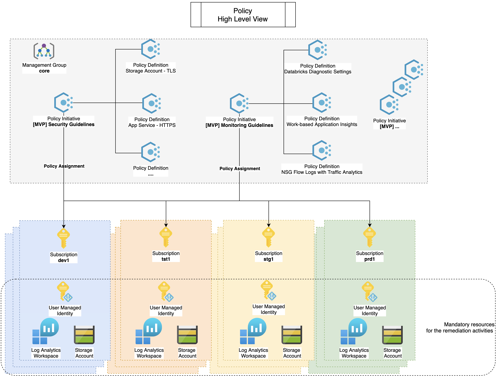

# Content
Share Azure Policies with the community.

The approach is to use [built-in](https://docs.microsoft.com/en-us/azure/governance/policy/samples/built-in-policies?WT.mc_id=AZ-MVP-5003548) Azure policies whenever they exist, otherwise we use custom policies with the trigram "MVP".

These are the guidelines used for the remediation activities ([effect "DeployIfNotExists"](https://docs.microsoft.com/en-us/azure/governance/policy/how-to/remediate-resources?WT.mc_id=AZ-MVP-5003548)):
- Use of ARM template whenever the remediation action creates a new resource.
- Use of [deployment scripts in ARM templates](https://docs.microsoft.com/en-us/azure/azure-resource-manager/templates/deployment-script-template?WT.mc_id=AZ-MVP-5003548) whenever the remediation action need to modify a resource that already exist. 

I do recommend these guidelines to prevent some change to be pushed by ARM template on parameters you don't want to touch.
You can consult this article [ARM template deployment what-if operation](https://docs.microsoft.com/en-us/azure/azure-resource-manager/templates/template-deploy-what-if?WT.mc_id=AZ-MVP-5003548) for more information.

# Reference
- [Using GitHub for Azure Policy as Code](https://techcommunity.microsoft.com/t5/azure-governance-and-management/using-github-for-azure-policy-as-code/ba-p/1886464?WT.mc_id=DOP-MVP-5003548)
- [Tutorial: Implement Azure Policy as Code with GitHub](https://docs.microsoft.com/en-us/azure/governance/policy/tutorials/policy-as-code-github?WT.mc_id=DOP-MVP-5003548)
- [Design Azure Policy as Code workflows](https://docs.microsoft.com/en-us/azure/governance/policy/concepts/policy-as-code?WT.mc_id=DOP-MVP-5003548)
- [Azure Policy initiative definition structure](https://docs.microsoft.com/en-us/azure/governance/policy/concepts/initiative-definition-structure?WT.mc_id=DOP-MVP-5003548)

# Pre-requisites
- [A Log Analytics workspace with the access control mode set to the use resource or workspace permissions setting](https://docs.microsoft.com/en-us/azure/azure-monitor/learn/quick-create-workspace?WT.mc_id=AZ-MVP-5003548)
- [A user-assigned managed identity. This identity is used to perform Azure-specific some policy remediation actions through the deployment scripts in ARM templates](https://docs.microsoft.com/en-us/azure/azure-resource-manager/templates/template-tutorial-deployment-script?WT.mc_id=DOP-MVP-5003548)
- [Configure the minimum permissions for this managed identity](https://docs.microsoft.com/en-us/azure/azure-resource-manager/templates/deployment-script-template?WT.mc_id=AZ-MVP-5003548#configure-the-minimum-permissions)
- (If using the script [launch.ps1](launch.ps1)) PowerShell modules : Az.ManagedServiceIdentity (min 0.7.3), Az.PolicyInsights (min 1.3.1)

# Policies
## High Level View
1. A list of policies and policies initiatives definitions are created in a management group called *core*
2. Role assignment are done at the subscription level per policy initiative definition



## [MVP] Monitoring Guidelines
- [[MVP] Deploy Diagnostic Settings for Storage Accounts to Log Analytics workspace](https://docs.microsoft.com/en-us/azure/storage/blobs/monitor-blob-storage?WT.mc_id=AZ-MVP-5003548)
- [[MVP] Deploy Diagnostic Settings for Azure Databricks](https://docs.microsoft.com/en-us/azure/databricks/administration-guide/account-settings/azure-diagnostic-logs?WT.mc_id=DOP-MVP-5003548)
- [[MVP] Deploy Workspace-based Application Insights](https://docs.microsoft.com/en-us/azure/azure-monitor/app/convert-classic-resource?WT.mc_id=DOP-MVP-5003548)
- [[MVP] Deploy Diagnostic Settings for Azure Windows Virtual Desktop](https://medium.com/faun/diagnostic-settings-for-azure-windows-virtual-desktop-resources-part-2-4bfb9ce8d1be)
- [Deploy Diagnostic Settings for Key Vault to Log Analytics workspace](https://docs.microsoft.com/en-us/azure/azure-monitor/insights/key-vault-insights-overview?WT.mc_id=AZ-MVP-5003548)
- [[Preview]: Deploy Diagnostic Settings for Recovery Services Vault to Log Analytics workspace for resource specific categories](https://docs.microsoft.com/en-us/azure/backup/configure-reports?WT.mc_id=AZ-MVP-5003548)

## [MVP] Security Guidelines
- [Enable Security Center's auto provisioning of the Log Analytics agent on your subscriptions with custom workspace](https://docs.microsoft.com/en-us/azure/security-center/security-center-enable-data-collection?WT.mc_id=AZ-MVP-5003548)
- [Deploy export to Log Analytics workspace for Azure Security Center data](https://docs.microsoft.com/en-us/azure/security-center/continuous-export?WT.mc_id=AZ-MVP-5003548)
- [[MVP] Secure transfer to storage accounts should be enabled](https://docs.microsoft.com/en-us/azure/storage/common/storage-require-secure-transfer?toc=%2Fazure%2Fstorage%2Fblobs%2Ftoc.json&WT.mc_id=AZ-MVP-5003548)
- [[MVP] Latest TLS version should be used in your Storage Accounts](https://docs.microsoft.com/en-us/azure/storage/common/transport-layer-security-configure-minimum-version?toc=%2Fazure%2Fstorage%2Fblobs%2Ftoc.json&WT.mc_id=AZ-MVP-5003548)
- [[MVP] Storage account public access should be disallowed](https://docs.microsoft.com/en-us/azure/storage/blobs/anonymous-read-access-configure?WT.mc_id=AZ-MVP-5003548)
- [[MVP] Latest TLS version should be used in your Web App](https://azure.microsoft.com/fr-fr/updates/app-service-and-functions-hosted-apps-can-now-update-tls-versions/?WT.mc_id=DOP-MVP-5003548)
- [[MVP] Latest TLS version should be used in your API App](https://azure.microsoft.com/fr-fr/updates/app-service-and-functions-hosted-apps-can-now-update-tls-versions/?WT.mc_id=DOP-MVP-5003548)
- [Latest TLS version should be used in your Function App](https://azure.microsoft.com/fr-fr/updates/app-service-and-functions-hosted-apps-can-now-update-tls-versions/?WT.mc_id=DOP-MVP-5003548)

## [MVP] Backup Guidelines
- [ [MVP] Key vaults should have soft delete enabled](https://docs.microsoft.com/en-us/azure/key-vault/general/key-vault-recovery?WT.mc_id=AZ-MVP-5003548)
- [ [MVP] Storage Accounts Blob should have soft delete enabled](https://docs.microsoft.com/en-us/azure/storage/blobs/soft-delete-blob-overview?WT.mc_id=AZ-MVP-5003548)
- [Azure Backup should be enabled for Virtual Machines](https://docs.microsoft.com/en-us/azure/backup/policy-reference?WT.mc_id=AZ-MVP-5003548)

# How to

## Create or Update Azure Policies Definition and Azure Policies Initiative Definition
### Method 1: with PowerShell 
**Prerequisites**

* Use an account that has the privilege [Resource Policy Contributor](https://docs.microsoft.com/en-us/azure/role-based-access-control/built-in-roles?WT.mc_id=AZ-MVP-5003548#resource-policy-contributor) on the management group that will host your policies.
* If you are processing role assignment use an account that has the [User Access Administrator](https://docs.microsoft.com/en-us/azure/role-based-access-control/built-in-roles?WT.mc_id=AZ-MVP-5003548#user-access-administrator) privilege on the target scope of your role assignment.

**Action**

Execute the script [launch.ps1](launch.ps1).

* Note: this script launches also a compliance scan on each scope where you have assigned your policy.

### Method 2: with GitHub Action

1. Set up Secrets in GitHub Action workflows
Some detail are explained [here](https://github.com/Azure/actions-workflow-samples/blob/master/assets/create-secrets-for-GitHub-workflows.md), in addition you can assign the privilege [Resource Policy Contributor](https://docs.microsoft.com/en-us/azure/role-based-access-control/built-in-roles?WT.mc_id=DP-MVP-5003548#resource-policy-contributor) to the service principal you have just created for GitHub Action.

2. Use Azure GiHub Action with azure/manage-azure-policy@v0, see file ./.github/workflows/manage-azure-policy.yml
 - Sample to create or update all policies: 
    - name: Create or Update Azure Policies
      uses: azure/manage-azure-policy@v0
      with:
        paths: |
          policies/**
          initiatives/**

*Important note*: if you want to proceed assignment of policies that use make sure to fill in the App Registration detail into the following brackets on the assign.<Policy>.json file
```
"identity": {
  "principalId": "The Identity principalId",
  "tenantId": "Your Tenant Id",
  "type": "SystemAssigned"
}
```

# Disclaimer

The sample scripts are not supported under any Microsoft standard support program or service. The sample scripts are provided AS IS without warranty of any kind. Microsoft further disclaims all implied warranties including, without limitation, any implied warranties of merchantability or of fitness for a particular purpose. The entire risk arising out of the use or performance of the sample scripts and documentation remains with you. In no event shall Microsoft, its authors, or anyone else involved in the creation, production, or delivery of the scripts be liable for any damages whatsoever (including, without limitation, damages for loss of business profits, business interruption, loss of business information, or other pecuniary loss) arising out of the use of or inability to use the sample scripts or documentation, even if Microsoft has been advised of the possibility of such damages.